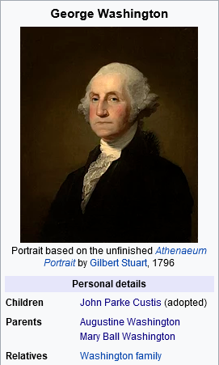

# Genea

Pronounced "genie". Scrape parent-child relationships from Wikipedia infoboxes.

## Why Infoboxes?

Infoboxes give us a digest of a particular Wikipedia page, in addition to the
relational information that we'll need to build a tree. 

<p align="center">
    
</p>
<p align="center">
    <i>
        Modified infobox as seen on the
        <a href="https://en.wikipedia.org/wiki/George_Washington">
            Wikipedia page for George Washington
        </a>
    </i>
</p>

In the image above, we can see rows of data under the "Personal Details"
section; each of these rows contain a header (bolded text) and (typically)
associated links.

We'll use regular expression patterns to match with these headers, some of
which provide ancestral relationships ("Parents", in this case), some provide
descendant relationships ("Children"), and others that could provide extra
links that we can walk out from ("Relatives").

Let's try out the above example.

## Installation

Clone this repository to your local machine with git, then install with Python.

```bash
git clone https://github.com/shanedrabing/genea.git
cd genea
python setup.py install
```

## Getting Started

Run the program with Python.

```bash
python genea.py "George Washington" "^Parent" "^Child"
```

### Positional Arguments

- `term` : Search term. Redirects to initial Wikipedia page.
- `pre` : (optional, regex) If matched, will add ancestor.
- `post` : (optional, regex) If matched, will add descendant.

### Named Arguments

- `-n [STEPS]` : How many steps to walk from initial page?
- `-e [EXTRA]` : (regex) If matched, will add additional links (no relation).

## Example Output

```txt
ANCESTORS of George Washington
├── Augustine Washington Sr.  
│   ├── Mildred Gale
│   │   └── Augustine Warner Jr.
│   │       └── Augustine Warner
│   └── Lawrence Washington
│       └── John Washington
│           └── Lawrence Washington
└── Mary Washington

DESCENDANTS of George Washington
└── John Parke Custis
    ├── George Washington Parke Custis
    │   ├── Mary Anna Custis Lee
    │   │   ├── Eleanor Agnes Lee
    │   │   ├── George Washington Custis Lee
    │   │   ├── William Henry Fitzhugh Lee
    │   │   ├── Robert E. Lee Jr.
    │   │   ├── Mildred Childe Lee
    │   │   ├── Anne Carter Lee
    │   │   └── Mary Custis Lee
    │   └── Maria Carter Syphax
    ├── Martha Parke Custis Peter
    ├── Elizabeth Custis Law
    └── Eleanor Parke Custis Lewis
```

## See Also

Try out these other searches!

```bash
python genea.py "Ford Quadricycle" "^Predecessor" "^Successor"
python genea.py "Secretariat (horse)" "^(Sire|Dam)$" --extra "sire"
python genea.py "Windows XP" "^(Preceded by)$" "^(Succeeded by)$"
python genea.py "Disney" "Parent" "(Divisions|Subsidiaries)"
```

## License

[MIT](https://choosealicense.com/licenses/mit/)
